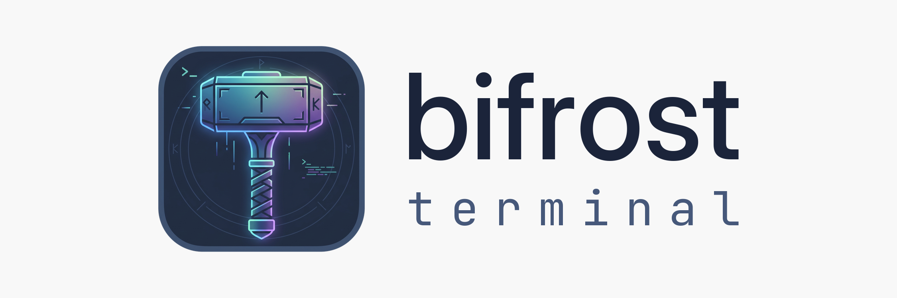

	<picture>
		<source media="(prefers-color-scheme: dark)" srcset="./assets/bifrost/bifrost-logo-horizontal-dark.png">
		<source media="(prefers-color-scheme: light)" srcset="./assets/bifrost/bifrost-logo-horizontal-light.png">
		
	</picture>
   

# Bifrost Terminal

Bifrost Terminal is a personal, independently maintained fork of [Wave Terminal](https://github.com/wavetermdev/waveterm) by Command Line Inc. It is not affiliated with or endorsed by Command Line Inc. Wave Terminal is a trademark of its owners.

Bifrost Terminal (like Wave Terminal) is an open-source, AI-integrated terminal for macOS, Linux, and Windows. It works with any AI model. Bring your own API keys for OpenAI, Claude, or Gemini, or run local models via Ollama and LM Studio. No accounts required.

It also supports durable SSH sessions that survive network interruptions and restarts, with automatic reconnection. Edit remote files with a built-in graphical editor and preview files inline without leaving the terminal.

## Key Features

- Wave AI - Context-aware terminal assistant that reads your terminal output, analyzes widgets, and performs file operations
- Durable SSH Sessions - Remote terminal sessions survive connection interruptions, network changes, and app restarts with automatic reconnection
- Flexible drag & drop interface to organize terminal blocks, editors, web browsers, and AI assistants
- Built-in editor for editing remote files with syntax highlighting and modern editor features
- Rich file preview system for remote files (markdown, images, video, PDFs, CSVs, directories)
- Quick full-screen toggle for any block - expand terminals, editors, and previews for better visibility, then instantly return to multi-block view
- AI chat widget with support for multiple models (OpenAI, Claude, Azure, Perplexity, Ollama)
- Command Blocks for isolating and monitoring individual commands
- One-click remote connections with full terminal and file system access
- Secure secret storage using native system backends - store API keys and credentials locally, access them across SSH sessions
- Rich customization including tab themes, terminal styles, and background images
- Powerful `wsh` command system for managing your workspace from the CLI and sharing data between terminal sessions
- Connected file management with `wsh file` - seamlessly copy and sync files between local and remote SSH hosts

## Wave AI

Wave AI is your context-aware terminal assistant with access to your workspace:

- **Terminal Context**: Reads terminal output and scrollback for debugging and analysis
- **File Operations**: Read, write, and edit files with automatic backups and user approval
- **CLI Integration**: Use `wsh ai` to pipe output or attach files directly from the command line
- **BYOK Support**: Bring your own API keys for OpenAI, Claude, Gemini, Azure, and other providers
- **Local Models**: Run local models with Ollama, LM Studio, and other OpenAI-compatible providers
- **Coming Soon**: Command execution (with approval)

Upstream documentation for these features is at [docs.waveterm.dev](https://docs.waveterm.dev). It describes Wave Terminal and may differ from Bifrost Terminal.

## Installation

Bifrost Terminal is built from source. See [Building Bifrost Terminal](BUILD.md).

### Minimum requirements

Bifrost Terminal runs on the following platforms:

- macOS 11 or later (arm64, x64)
- Windows 10 1809 or later (x64)
- Linux based on glibc-2.28 or later (Debian 10, RHEL 8, Ubuntu 20.04, etc.) (arm64, x64)

The WSH helper runs on the following platforms:

- macOS 11 or later (arm64, x64)
- Windows 10 or later (x64)
- Linux Kernel 2.6.32 or later (x64), Linux Kernel 3.1 or later (arm64)

## What Bifrost adds

- Bifrost theme and branding
- Realms
- Focus mode (F11) with a full-screen focus layout and tab strip
- Rune tab badges and OS notifications, with click to jump to the source
- Pop-out windows, with tabs and panes moved between windows

## Roadmap

[ROADMAP.md](./ROADMAP.md) is kept from upstream Wave Terminal for reference.

## Issues and Feature Requests

Use [GitHub Issues](https://github.com/heinsutton/bifrost-terminal/issues) on this fork. Problems that also affect upstream Wave Terminal can be reported at [wavetermdev/waveterm](https://github.com/wavetermdev/waveterm/issues).

## Building from Source

See [Building Bifrost Terminal](BUILD.md).

## Contributing

Issues and pull requests on this fork are welcome. See [CONTRIBUTING.md](CONTRIBUTING.md).

## Acknowledgements

Bifrost Terminal is based on [Wave Terminal](https://github.com/wavetermdev/waveterm), created by Command Line Inc. and its contributors. Thank you to them for building it and releasing it as open source. Third-party dependency licences are listed in [ACKNOWLEDGEMENTS.md](./ACKNOWLEDGEMENTS.md).

## License

Bifrost Terminal is licensed under the Apache-2.0 License (see [LICENSE](./LICENSE) and [NOTICE](./NOTICE)). It is based on Wave Terminal, © Command Line Inc., also Apache-2.0. Modified files are tracked in this repository's git history.
